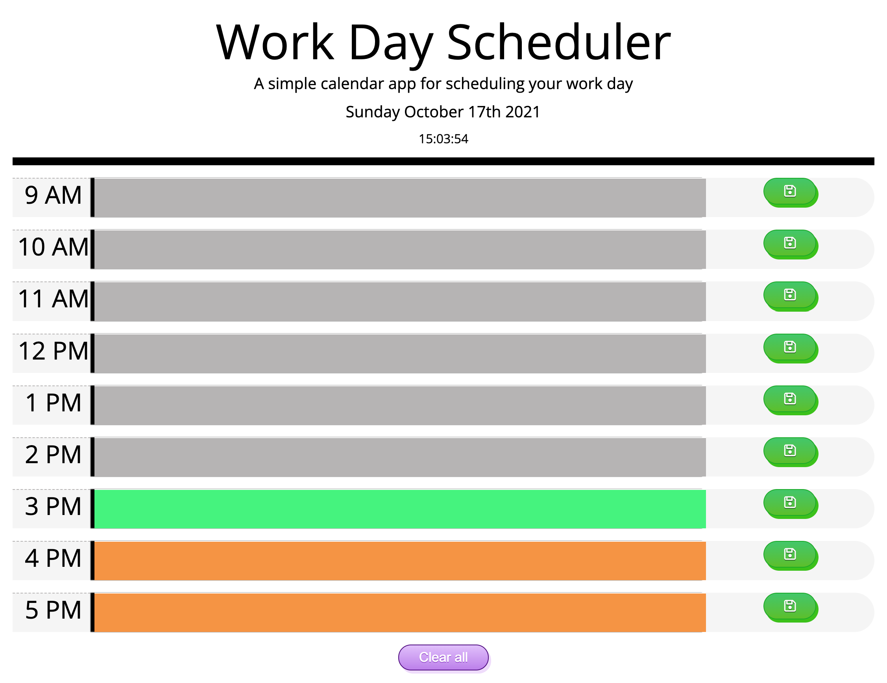

# work-day-scheduler

A simple calendar application that allows a user to save events for each hour of the day by modifying starter code.

# The Work day Planner

## Description

This is a flat and responsive calendar application that runs in the browser and allows the user to save events for each hour of the day. It presents on the header the exactly date and time of when the user opened the application. If the calendar box is on the past it will be present in grey, if in the present hour, will be presented in green and if in the future, the time block will be presented in orange. Also the events saved will be stored and wh All designed and coded by Luiz Froes.

## Deployed URL

You can view the GitHub pages deployed application [here](https://luizfroes.github.io/work-day-scheduler/)

## Technologies Used

- HTML5
- Bootstrap
- CSS
- Font Awesome
- JavaScript
- JQuery

## Screenshots

### Layout Designs

### Final Website

